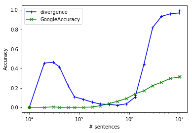
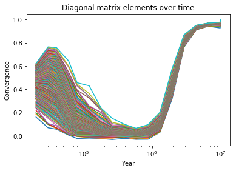
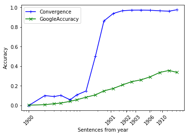

# Data-driven measure of convergence for word embeddings
C. Martinez-Ortiz, J. Attema, [add your name here]

## Abstract
Word embeddings have been used in a wide range of applications. It is generally agreed that training a word embedding requires a significant amount of data, however it is never entirely clear how much data is enough for the word embedding to capture the semantic structure of the language it is being trained with. Specific tests, based on word analogies, have been used to decide when a word embedding has captured enough of the language structure to be considered meaningful. However this approach has several issues, amongst others the language specificity of such tests.

In this paper we propose a completely data-driven method for determining the level of convergence of a semantic model, which enables us to train semantic models with enough data for the model to capture the semantic structure of language and stop the training when the model does not benefit significantly from the additional data. The proposed method measures the amount of change induced by each additional batch of data used to train the model; the internal structure of the model will continue to change as long as the model is still learning. Once the internal structure of the model stops changing, then the model can be considered as *stable* and the training can stop.

The proposed method can be particularly useful when a limited amount of data is available or when the available data should be divided to train several models.

We compare our method with existing word analogy tests and show how our method still performs well in situations where word analogies are unable to perform as expected.

## Introduction
Since their introduction [Mikolov_CS2013], word embeddings have become increasingly popular and have been used for a wide range of applications [Mikolov_CoRR2013, Kim_CoRR2014, Levy_CNLL2014, Cordeiro_ACL2016, Smith_ICLR2017]. Word embeddings are often trained using large data sets, such as the Google News corpus [https://code.google.com/archive/p/word2vec/], incorporating 100 billion words. The generally accepted approach when training word embeddings is "the more data, the better", and there does not appear to be any consensus on the minimum amount of data required to train a word embedding model which yields good results.

A widely accepted method for evaluating word embeddings is by testing their performance in analogy tests: *man : woman :: king : **queen***. Data sets for testing analogies are widely available [see https://www.aclweb.org/aclwiki/index.php?title=Google_analogy_test_set_(State_of_the_art)]. However there several known issues with such tests [cite https://blog.conceptnet.io/2016/06/01/cramming-for-the-test-set-we-need-better-ways-to-evaluate-analogies/ ?]:

 - **Language specific** - analogies are usually language specific -- training a word embedding model on a language different from that of the analogies will obviously lead to failing the test;
 - **Constrained by vocabulary** - because word embeddings typically have a set vocabulary; analogies which use out-of-vocabulary words, will always fail;
 - **Domain specific** - analogies usually fall in a particular knowledge category. For instance the following analogy: *Athens : Greece :: Baghdad : Iraq*, is specific to Geographical facts; a semantic model trained on a data set which does not contain such knowledge (which never mentions these locations) is bound to fail this test. At the same time, a word embedding may have already learnt a domain specific analogy, such as *electron : electricity :: photon : light*, but if this analogy is not reflected on the analogy test set, there is no way to know the semantic model already incorporates this knowledge.

These issues can be addressed, for instance, by translating the analogy test set, discarding analogies which are irrelevant for the training data being used, constructing suitable analogies, etc. However all of these approaches are labour intensive and must be hand crafted for each training data set. This work is motivated by the desire to find a data-driven method to validate word embeddings. The data-driven method introduced here does not rely on word analogies and therefore does not require the analogies to be translated or otherwise adapted in order to function. This makes our approach effectively language independent. This may also be particularly useful in cases where the available amount of data for a particular domain is relatively small.

The data-driven method for word embedding evaluation measures the amount of change in the semantic space at every stage of the training. Large variation in the semantic space indicates that the model has acquired a large amount of knowledge from a given batch of data. Small variation in the semantic space indicates that the given batch of data has contributed little new information to the model. Once the variation in the model falls below a given threshold, the model is assumed to have assimilated enough information from the data to be able to capture the semantic structure of the data set.

This paper is structured as follows: the **Method** section describes the data-driven procedure for measuring convergence of word embeddings;  the **Experiments** section describes the setup used to evaluate word embedding convergence; the **Results** section discusses the evaluation; concluding remarks are presented in the **Conclusion** section.

## Method
We will start by giving a brief overview of how semantic models work, more details can be found in the original papers [Mikolov_CS2013]. Semantic models work by creating a semantic space in which each word in the known vocabulary is represented by a vector. This semantic space has dimensions *N*, which is set at the beginning of the training process. The size of the vocabulary, *V*, is also determined from the start. Note that it is not unusual to restrict the vocabulary size to only include words which appear frequently (more than *k* times) on the corpus. The semantic space is represented by an embedding matrix *S* of size *NxV*.

Any given word *w* in the vocabulary can be represented in "vocabulary space" as a vector of size *V* using "one-hot" encoding. We can use matrix *S* to find the embedding of *w*, which we call *e_w*:

$$e_w = S \cdot w$$

Vector *e_w* is represented size *N*; words which have similar meaning will be located close by in this semantic space - word similarity is usually measured using cosine similarity [ref?]. The semantic model learns the structure of the semantic space by analysing sentences in the corpus and updating the *S* matrix. We are interested in finding a matrix *S* which is a good representation of our data. We need to compare different versions of *S* changing over time: *S_1*, *S_2*, ..., *S_t*. Given two points in time, *A* and *B*, there will be two versions of the embedding matrix, *S_A* and *S_B*, we want to find a transformation matrix such that:

$$S_B \approx S_A \cdot T$$

The transformation matrix $T$ can be found iteratively using the procedure described in Pseudocode 1: (**@Jisk -- since you wrote this part of the code, do you think it would be better to add a more rigorous mathematical description?**)

#### Pseudocode 1 - Find T for $S_A$ to $S_B$
```
For each dimension `i` in the embedded space:
  Let V1_i be a unit vector along the i-th dimension of the embedded space S_A
  Let W_i be V1_i projected back into vocabulary space (*)
  *If the vocabularies are different we need to convert W_i to the other vocabulary*
  Let V2_i be W_i projected in embedded space S_B
  Let V2_i be the i-th dimension of the transformation matrix T
```
** *NOTE:** to convert $V1_i$ back into vocabulary space, we take the dot product of the embedded vector and the inverse of embedding matrix.

*T* will end be of size *NxN*.

We will use the transformation *T* to measure how much the embedded space has changed between times *A* and *B*. To ensure that our measure is symmetric, we will calculate two transformation matrices, *T(A,B)* to go from *A* to *B* and *T(B,A)* to go from *B* to *A*. We call the element-wise product of these two matrices the divergence matrix:

$D(A,B) = T(A,B) * T(B,A)$

It is important to mention that the divergence matrix will be equal the identity matrix if the space embeddings *S_A* and *S_B* are equivalent).

## Experiments
In this section we describe the experimental process we have followed to validate our approach. For this experiment we used the Times news paper archives (*I need to ask Jose how can we reference the corpus*) between 1900 and 1980. We trained a semantic model, using gensim word2vec implementation [ref]. We set the dimensions on the semantic space to 300 (*N = 300*).

The vocabulary was limited to use a maximum of 1GB of memory; further, *nltk* was used to remove non-words and stop-words [ref nltk]. The resulting models had a maximum vocabulary size of 22,000 words. Notice that stop-word removal yielded a better final model with our data, but it does not affect the calculation of the divergence matrix.

We used batches of 10,000 sentences taken from randomly selected years in the corpus. After each batch is added to the model being trained, a snapshot of the embedding is taken. We continue to feed batches to the model until it has been trained with 10 million sentences.

We use *D(A,B)* measure the change in the semantic space in two different ways:

 - By taking the normalized trace of *D(A,B)* - this will be equal to 1 if *S_A* and *S_B* are equivalent and yield a value between 0 and 1 if they are different. We call this *convergence score*.
 - By looking at the values in the main diagonal of *D(A,B)* - these values will be equal to 1 if *S_A* and *S_B* are equivalent and yield a value between 0 and 1 if they are different. This is similar to looking at the trace, but it provides additional information regarding the changes in the structure of the semantic space: are all vectors in the semantic space changing? Or are some of these vectors stable while others are changing significantly? We call this *diagonal convergence scores*, and they provide not only information regarding whether the semantic space is changing, but also how it is changing.

For comparison, we also use the Google "questions-words" analogy data set [ref]. It should be mentioned that some of the analogy tests failed for every one of our trained models because some words in those tests were not present in our corpus (more specifically, they were not present with enough frequency to be part of the vocabulary in our models). For example, even after training with 10 million sentences, our model fails for the analogy: *London : England :: Montevideo : Uruguay*. This is however not surprising as *Montevideo* appears only a 87 times in the first million sentences (for reference, London appears in 21,000 sentences). Notice that the proposed measure calculates the difference between two embeddings, while the question words evaluates the individual accuracy of a given model.

## Results
Figure 1 shows the convergence score (blue) as the number of sentences increases, and the Google accuracy (green). After $10^6$ sentences have been used for training the model, there is a rapid increase in the convergence score. This indicates that the vectors defining the semantic space are becoming more stable. Training the model with additional sentences will produce little change in the model.

On the other hand, the Google accuracy score increases slowly but steadily. However, it requires a large number of sentences to increase the performance of the model. Depending on the application, there might be a trade off between the cost of using additional data and the benefit of doing so (notice that such a cost may not be economical but in terms of time, availability of data, or otherwise). In such cases it may be beneficial to stop once the cost/benefit balance crosses a certain point.



At around $2 * 10^4$ sentences, there is a local maxima on the convergence score, but its value drops down at around $10^5$ sentences only to increase again at $10^6$ sentences. Such behaviour is indeed confusing; here we use the diagonal convergence scores gain some insight.

Figure 2 shows the values on the diagonal of diagonal convergence scores as the number of sentences increases. Each line represents the convergence score for one particular dimension of the semantic space. What we see here is that around $2 * 10^4$ sentences there is wide variety of values for the convergence scores -- some dimensions of the semantic space are relatively stable (high convergence scores) while others are undergoing significant change (low convergence scores). As more sentences are added to the model, the changes in semantic model become more widespread, until finally the model becomes globally stable.



## Temporal corpus slicing
Semantic models have been used for diachronic analysis of vocabulary [ref shico & Hellrich_COLING2016 & refs in Hellrich_COLING2016]. In such cases a corpus must be divided in temporal slices. Each of these slices will contain a subset of the corpus, with documents from a specific period (e.g. documents written between 1900 - 1905). This imposes a constraint in the volume of data available to train the model. In such scenario, the trade off between accuracy and data availability becomes evident: slices covering shorter time spans (e.g. a single year) will be more useful for temporal analysis of the data (e.g. allowing to identify the year when a change in the language took place); at the same time, the model will have less data available for training, thus compromising accuracy.

In order to find the optimal number of years to be used for temporal slices on the Times corpus described above, we trained semantic models, adding data in chronological order from 1900 onwards, and taking snapshots every 1/2 million sentences. The following figure shows the convergence score for these models. The Google accuracy score is also included for reference.



As it can be seen, after the model has been trained with 5 million sentences, there is a noticeable increase in the convergence measure, indicating that the model has stabilized. This is a period equivalent to two years; from this we conclude that using two year temporal slices is suitable for this dataset.

## Conclusion
In this paper we have presented a data-driven method for measuring convergence of semantic models. This approach determines when a semantic model has been trained with enough data to capture the semantic structure of the data. This is useful when there is a trade off between longer training and more accurate models.

The convergence scores can be visualized as a single value over time, as shown on Figure 1, or as a collection of values as shown on Figure 2. The first form of visualization is more straight forward, while the second provides additional insight into the structure of the semantic space as a whole.

This approach is entirely data-driven and does not depend on previous knowledge of the language being modelled or on a manually translated reference corpus. This will help remove previously existing limitations in the application of semantic models.

## References
xxx
